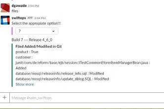
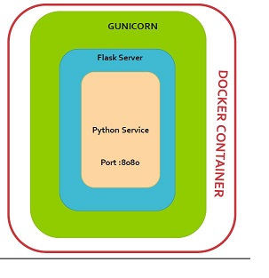

# Change Log Filter Microservice

This microservice is plugin for [SwiftOps](https://github.com/orgs/swiftops/teams/swiftops/repositories) bot engine used to filter change log response. It request and reads the data from the [Git log change](https://github.com/swiftops/git_change_log.git) microservice.
It fetch stat of file modified count, line of code insertion and line of deletation, also changed file name with its status as Added, Modified Or Deleted.
## Installation
### Checkout Repository

```
$git clone https://github.com/swiftops/git-changelog-filter.git
```
### 1. Deploy inside Docker
---
##### Pre-Requisite:
* Docker should be installed on your machine. Refer [Install Docker](https://www.digitalocean.com/community/tutorials/how-to-install-and-use-docker-on-ubuntu-16-04) documentation.
* Change property file  present in this repository 
    + system.properties to change db details
 

##### Steps to start microservice
Once you  done with pre-requisite exeute below command to start connection_leak_filter microservice
```
docker build -t <image-name>
docker run -p 5004:5004 --name ms-connleakfileterservice -d <image-name>
```
### 2. On Commit Auto-deploy on specific server.
---
* You need to configure Gitlab Runner to execute Gitlab CI/CD Pipeline. See [Gitlab Config](https://docs.gitlab.com/runner/install)
As soon as you configure runner auto deployment will start as you commited the code in repository.
refer .gitlab-ci.yml file.

### 3. Deploy on local environment.
----
#### Pre-Requisite
* Python 3.6.0
* MongoDB
* Change property file  present in this repository 
    + system.properties to change db details.


#### Create Virtual Environment
Virtualenv is the easiest and recommended way to configure a custom Python environment for your services. To install virtualenv execute below command: 
```sh
$pip3 install virtualenv
```
You can check version for virtual environment version by typing below command:
```sh
$virtualenv --version
```
Create a virtual environment for a project:
```
$ cd <my_project_folder>
$ virtualenv virtenv
```
virtualenv `virtenv` will create a folder in the current directory which will contain the Python executable files, and a copy of the pip library which you can use to install other packages. The name of the virtual environment (in this case, it was `virtenv`) can be anything; omitting the name will place the files in the current directory instead.

This creates a copy of Python in whichever directory you ran the command in, placing it in a folder named `virtenv`.

You can also use the Python interpreter of your choice (like python3.6).
```
$virtualenv -p /usr/bin/python3.6 virtenv
```
To begin using the virtual environment, it needs to be activated:
```
$ source virtenv/bin/activate
```
The name of the current virtual environment will now appear on the left of the prompt (e.g. (virtenv)Your-Computer:your_project UserName$) to let you know that it’s active. From now on, any package that you install using pip will be placed in the virtenv folder, isolated from the global Python installation. You can add python packages needed in your microservice development within virtualenv. 

#### Install python module dependanceies
```
pip install -r requirements.txt
```
#### To start microservice 
```
python services.py
```
#### To Acess microservice
```
http://<your-ip>:8084/changeservice/change_log_filter
```
## services
If there is no details for changelog then get the latest release and its latest build and display the changelog of latest and its previous build else if details are provided then get the changelog between given and its previous build.

```http
[POST] /changeservice/change_log_filter
```

This service takes input Release and build number in below format
`
query = 'change 4_4_0;20'
query = 'files 4_4_0;20'
`
#### Status Codes

 returns the following status codes in API:

| Status Code | Description |
| :--- | :--- |
| 200 | `OK` |
| 400 | `BAD REQUEST` |
| 404 | `NOT FOUND` |
| 500 | `INTERNAL SERVER ERROR` |


### Change log output on slack




### Architechture


##### Flask
[Flask](http://flask.pocoo.org/docs/1.0/quickstart/) is a micro web framework written in Python. It is classified as a microframework because it does not require particular tools or libraries.It has no database abstraction layer, form validation, or any other components where pre-existing third-party libraries provide common functions. However, Flask supports extensions that can add application features as if they were implemented in Flask itself.


##### Gunicorn
The [Gunicorn](http://docs.gunicorn.org/en/stable/configure.html) "Green Unicorn" (pronounced gee-unicorn)[2] is a Python Web Server Gateway Interface (WSGI) HTTP server. 

###### Features
* Natively supports WSGI, web2py, Django and Paster
* Automatic worker process management
* Simple Python configuration
* Multiple worker configurations
* Various server hooks for extensibility
* Compatible with Python 2.6+ and Python 3.2+[4]


##### Docker 
Docker is Container platform,more deails about [Docker](https://www.docker.com/get-started)


